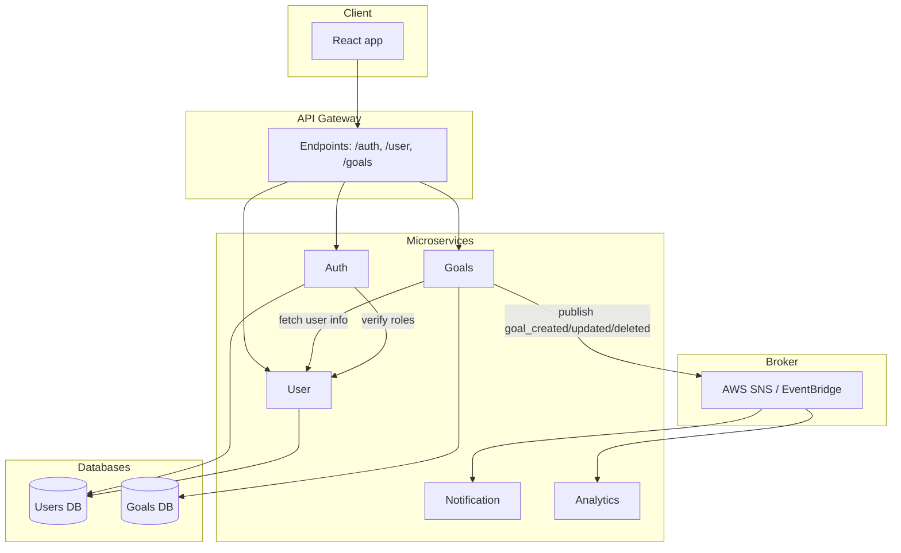

## Health goals

A microservice for managing user health goals.

---

## MACH architecture

- Microservice – follows the SRP principle, however, for the purposes of this exercise I’ve included basic user account management within this service (primarily for testing and convenience). In a production setup user management should be handled by a separate microservice.
- API first - Provides a REST API
- Cloud native - Ready for deployment using docker and `docker compose` might be easly deployed on AWS using ECS.
- Headless - Might be consumed by any frontend or service

---

## Setup

### Prerequisites

```
docker and docker compose
Node.js (v18+)
```

### Installation

```
git clone git@github.com:kuzmicz/health-goals-service.git
cd health-goals-service
docker compose up --build
```

API will be available at: http://localhost:3000

## Tests

The instructions specified that unit tests should be created, I believe that integration tests are better suited for testing API endpoints.

Run command in the root directory of the project:

`docker compose run --rm app npm test`

---

### Design choices

- Typescript - Chosen for type safety.
- MongoDB - Easy to use for that purpose, no advanced relations are required. Mongoose is used for schema definition.
- JWT - Solution for authentication in microservices.
- Layered architecture - The application is split into routes, controllers, services, middleware, validation and models to be modular and be easy to maintain.
- Joi - Used to enforce input schema at the request level.
- Docker - Application and database are containerized to allow for easy start on local environment and building for production.

### Assumptions

- No goal sharing - Each goal is user specific and private.
- No pagination - Since the number of health goals per user is expected to be small, no pagination is implemented at this stage. Should be considered if the number of goals per user increases significantly.
- MongoDB - Given the nature of health goal data and the simplicity of relationships, MongoDB was a better choice over relational databases.
- User ID is taken from JWT - The user ID is extracted from the JWT, which is used to scope access to goals (each user sees only their goals).

### Future considerations

- Correlation ID - Add correlation ID to enable tracing requests across distributed services and logs.
- Event driven architecture - Emit domain events (e.g., `GoalCreated`) to a message broker like RabbitMQ for better decoupling between services.

## Diagram

The diagram shows the intended microservice based infrastructure.


